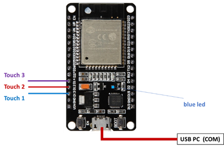

# Rappels

Avant de commencer à programmer un microcontrôleur, la première chose à faire consiste à regarder la documentation associée, dite « Datasheet », ainsi que les caractéristiques du microcontrôleur et son brochage.

_Schéma « pinout » pour l’ESP-WROOM-32 Module du NodeMCU :_&#x20;

<figure><figcaption></figcaption></figure>

LED0 est une LED bleue accessible via GPIO2. Installation sur l’IDE Arduino :

Ouvrez l’Arduino IDE, dans le menu : **Outils** à **Type de carte : "ESP32 Dev Module"**

<figure><figcaption></figcaption></figure>

Remarque :

Toutes les broches GPIO peuvent être utilisées pour des interruptions.
